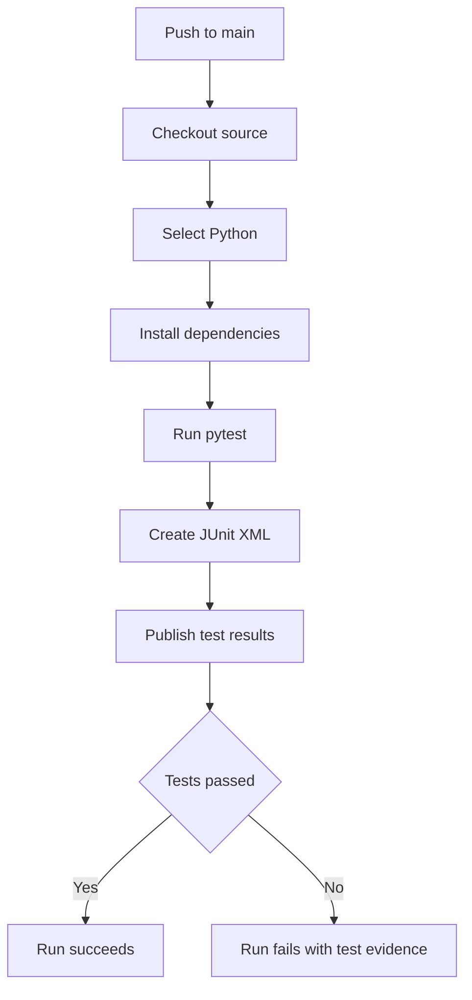

# Python CI

This diagram uses the standard fenced `mermaid` block supported by GitHub Markdown and current Azure DevOps Markdown. It intentionally uses conservative flowchart syntax.

Related YAML: [`../examples/01-python-ci.yml`](../examples/01-python-ci.yml)
