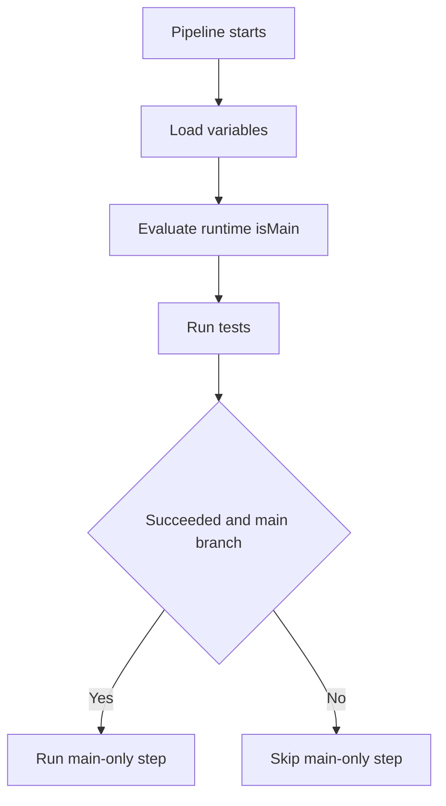

# Variables and conditions

This diagram uses the standard fenced `mermaid` block supported by GitHub Markdown and current Azure DevOps Markdown. It intentionally uses conservative flowchart syntax.

Related YAML: [`../examples/02-variables-and-conditions.yml`](../examples/02-variables-and-conditions.yml)
