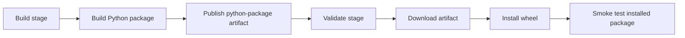

# Multi-stage artifact flow

This diagram uses the standard fenced `mermaid` block supported by GitHub Markdown and current Azure DevOps Markdown. It intentionally uses conservative flowchart syntax.

Related YAML: [`../examples/03-multi-stage-artifact.yml`](../examples/03-multi-stage-artifact.yml)
