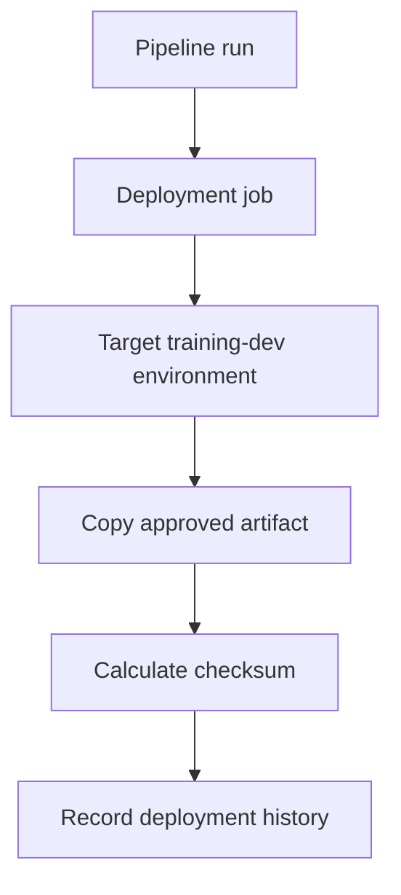

# Deployment environment

This diagram uses the standard fenced `mermaid` block supported by GitHub Markdown and current Azure DevOps Markdown. It intentionally uses conservative flowchart syntax.

Related YAML: [`../examples/04-deployment-environment.yml`](../examples/04-deployment-environment.yml)
