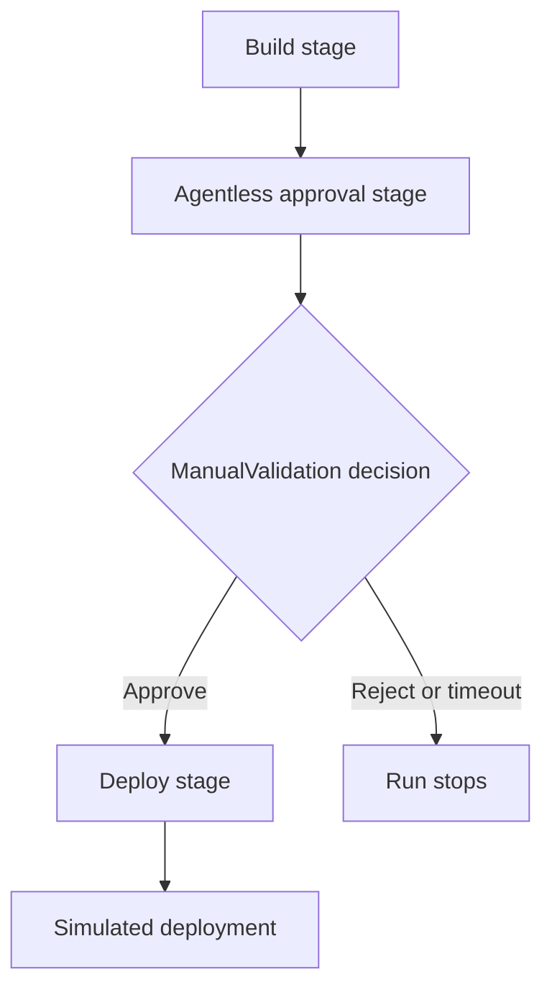

# Manual validation

This diagram uses the standard fenced `mermaid` block supported by GitHub Markdown and current Azure DevOps Markdown. It intentionally uses conservative flowchart syntax.

Related YAML: [`../examples/05-manual-validation.yml`](../examples/05-manual-validation.yml)
