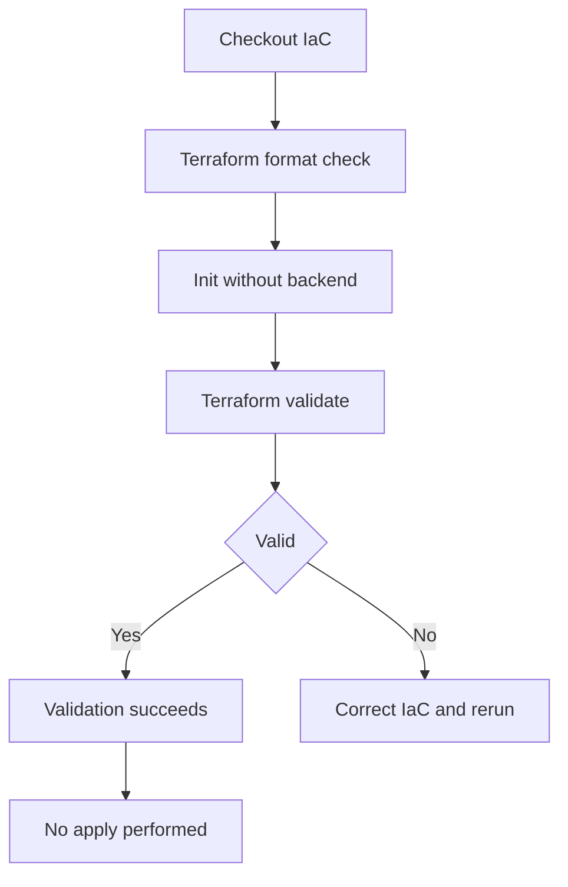

# Infrastructure as Code validation

This diagram uses the standard fenced `mermaid` block supported by GitHub Markdown and current Azure DevOps Markdown. It intentionally uses conservative flowchart syntax.

Related YAML: [`../examples/07-iac-validation.yml`](../examples/07-iac-validation.yml)
