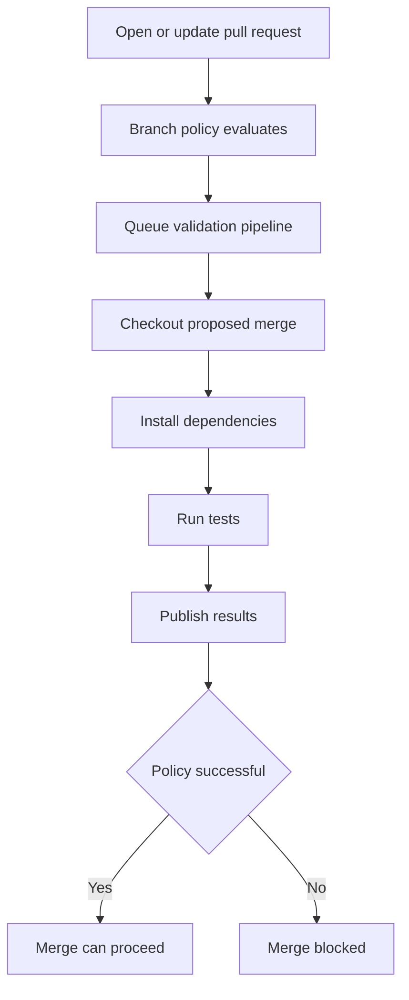

# Azure Repos PR validation

This diagram uses the standard fenced `mermaid` block supported by GitHub Markdown and current Azure DevOps Markdown. It intentionally uses conservative flowchart syntax.

Related YAML: [`../examples/08-pr-validation.yml`](../examples/08-pr-validation.yml)
