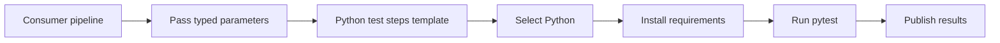

# Reusable test template

This diagram uses the standard fenced `mermaid` block supported by GitHub Markdown and current Azure DevOps Markdown. It intentionally uses conservative flowchart syntax.

Related YAML: [`../examples/09-template-consumer.yml`](../examples/09-template-consumer.yml)
